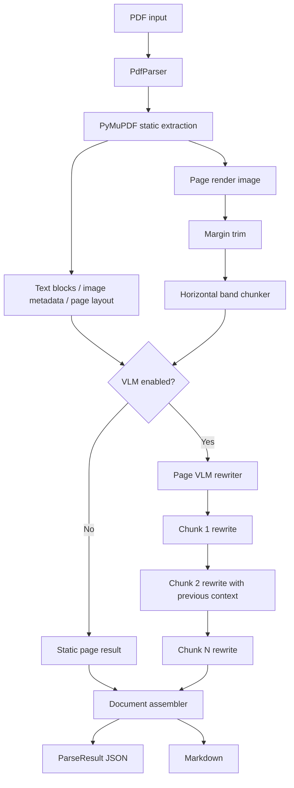

# PDF VLM Parser 설계서

작성일: 2026-06-13

## 목표

PDF 전용 parser 라이브러리를 만든다. 기본 동작은 PyMuPDF 기반 정적 추출이며, 옵션으로 OpenAI-compatible VLM API를 사용해 추출된 내용을 더 품질 높은 Markdown으로 rewriting한다.

라이브러리는 항상 구조화 JSON과 Markdown을 함께 출력해야 한다. 정적 추출 결과는 원본 텍스트, 레이아웃, 이미지 메타데이터, fallback 동작의 기준 데이터로 유지한다. VLM 출력은 읽기 순서, 레이아웃 해석, 표 formatting, 캡션, 페이지 단위 Markdown 품질을 개선하는 rewriting layer로 취급한다.

## 비목표

- DOCX, PPTX, HTML, 이미지 등 PDF가 아닌 입력.
- 전용 OCR 엔진.
- 표 전용 구조 복원 엔진.
- 문서 전체 단위 VLM cleanup.
- UI, layout editor, review workflow.
- Cloud storage integration.

## 핵심 결정

- 출력 형식: JSON과 Markdown.
- 정적 parser: PyMuPDF.
- VLM API 방식: 이미지 입력을 지원하는 OpenAI-compatible chat completions.
- VLM 작업 단위: page render image chunk.
- 페이지 처리: 페이지 간 병렬 처리 가능.
- Chunk 처리: 같은 페이지 내부의 chunk는 순차 처리.
- VLM rate control: 전역 concurrency limiter 1개.
- VLM fallback: VLM이 꺼져 있거나 실패해도 정적 추출 결과로 출력 생성.
- 초기 문서 범위: PDF만 지원.

## Architecture



## Public API

라이브러리의 주 진입점은 `PdfParser`다.

```python
from vlm_parser import PdfParser, ParseOptions, VlmOptions

parser = PdfParser(
    options=ParseOptions(
        render_dpi=180,
        trim=True,
        auto_slice=True,
    ),
    vlm=VlmOptions(
        enabled=True,
        base_url="https://api.example.com/v1",
        api_key="...",
        model="gpt-4.1-mini",
        max_concurrency=4,
    ),
)

result = parser.parse("sample.pdf")

result.to_json()
result.to_markdown()
result.save_json("out/result.json")
result.save_markdown("out/result.md")
```

정적 parsing만 사용할 때도 같은 API를 기본 옵션으로 사용한다.

```python
from vlm_parser import PdfParser

parser = PdfParser()
result = parser.parse("sample.pdf")
```

## Module Layout

```text
vlm_parser/
  __init__.py
  parser.py
  models.py
  options.py

  pdf/
    __init__.py
    document.py
    static_extractor.py
    renderer.py
    image_preprocess.py
    chunker.py

  vlm/
    __init__.py
    client.py
    prompts.py
    rewriter.py
    concurrency.py

  output/
    __init__.py
    assembler.py
    markdown.py
    json_schema.py

  errors.py
```

### Module Responsibilities

- `parser.py`: public orchestration entrypoint. PDF를 열고, 옵션을 적용하며, 페이지 처리를 실행하고 최종 출력을 조립한다.
- `models.py`: parse result, page, block, image, render, chunk, VLM result, warning, error를 위한 typed data model.
- `options.py`: parsing, rendering, trimming, chunking, VLM, retry, concurrency 설정 모델.
- `pdf/document.py`: PyMuPDF 기반 PDF document lifecycle wrapper.
- `pdf/static_extractor.py`: text block, line, span, page metadata, image metadata, raw page text를 추출한다.
- `pdf/renderer.py`: 각 페이지를 설정된 DPI의 이미지로 렌더링한다.
- `pdf/image_preprocess.py`: uniform 또는 near-uniform margin을 trim하되, 원본 render fallback을 보존한다.
- `pdf/chunker.py`: trimmed page image를 horizontal blank 또는 single-color band 기준으로 vertical chunk로 나눈다.
- `vlm/client.py`: OpenAI-compatible VLM client.
- `vlm/prompts.py`: chunk rewriting용 prompt builder.
- `vlm/rewriter.py`: 한 페이지 내부 chunk를 순차적으로 rewriting한다.
- `vlm/concurrency.py`: 전역 VLM request semaphore.
- `output/assembler.py`: page result를 최종 document JSON과 Markdown으로 합친다.
- `output/markdown.py`: static/VLM result를 Markdown으로 변환한다.
- `output/json_schema.py`: JSON schema export와 validation helper.
- `errors.py`: 라이브러리 전용 예외.

## Processing Flow

1. `PdfParser.parse(path)`가 PDF를 연다.
2. Parser가 각 페이지를 page worker pool에 제출한다.
3. 각 page worker가 PyMuPDF 정적 추출을 수행한다.
4. 각 page worker가 page image를 렌더링한다.
5. trim이 활성화되어 있으면 render image를 보수적으로 trim한다.
6. auto-slice가 활성화되어 있으면 trimmed image를 vertical chunk로 나눈다.
7. VLM이 비활성화되어 있으면 static Markdown을 page 단위로 생성한다.
8. VLM이 활성화되어 있으면 page의 chunk를 위에서 아래 순서로 순차 rewriting한다.
9. 모든 VLM request는 전역 concurrency limiter를 통과한다.
10. Page result를 page number 순서로 정렬해 최종 document result로 조립한다.

## Rendering And Trim Design

Renderer는 PDF page마다 page image 1개를 만든다. Trim 단계는 rendered bitmap을 검사해서 흰색 또는 near-uniform single-color인 바깥 margin만 제거한다.

Trim 동작:

- 상, 하, 좌, 우 uniform margin 후보를 감지한다.
- 흰색과 near-uniform background color를 trim 후보로 취급한다.
- 모서리 콘텐츠가 감지되면 원본 render를 유지한다.
- 감지된 trim 영역이 과도하게 크면 원본 render를 유지한다.
- `original_size`, `trimmed_size`, `bbox_in_original`, `applied`, `reason`을 기록한다.

Trim은 보수적으로 동작해야 한다. False negative는 VLM에 더 큰 이미지를 보내는 정도라 허용 가능하다. False positive는 문서 내용을 잘라낼 수 있으므로 더 위험하다.

## Chunking Design

Chunking은 trimmed page image를 기준으로 수행한다.

입력:

- Trimmed page image.
- Original render size.
- Trim bounding box.
- `min_chunk_height_px`.
- `max_chunk_height_px`.
- `blank_band_min_height_px`.
- `background_tolerance`.
- `edge_content_guard_px`.

Algorithm:

1. 이미지의 각 row가 대부분 blank, white, near-uniform인지 계산한다.
2. 연속된 candidate row를 horizontal blank band로 병합한다.
3. `blank_band_min_height_px`보다 짧은 candidate band는 버린다.
4. 페이지를 위에서 아래로 순회한다.
5. chunk가 `max_chunk_height_px`를 넘기 전에 가장 가까운 valid blank band를 split line으로 선택한다.
6. `min_chunk_height_px`보다 작은 chunk가 생기는 split은 피한다.
7. 안전한 blank band가 없으면 위험한 강제 split 대신 큰 영역을 하나의 chunk로 유지한다.
8. 각 chunk의 bounding box를 original image coordinate와 trimmed image coordinate 양쪽에 기록한다.

Chunking policy:

- Split은 vertical 방향으로만 수행한다.
- Split 후보는 horizontal blank 또는 single-color band에서 나온다.
- Chunker는 공격적으로 작은 chunk를 많이 만들기보다 더 적고 안전한 chunk를 선호한다.
- Page-level context는 chunk를 순차 처리해 유지한다.

## VLM Rewriting

VLM rewriter는 VLM 옵션이 활성화된 경우에만 실행된다.

각 페이지 처리:

1. Static page extraction, page render metadata, image chunk를 받는다.
2. Chunk를 reading order 기준으로 위에서 아래로 처리한다.
3. 각 chunk마다 다음 정보를 포함한 VLM request를 만든다.
   - 현재 chunk image.
   - Page index와 chunk index.
   - Page-level static text.
   - Chunk bounding box metadata.
   - 이전 chunk Markdown 또는 compact accumulated context.
4. Model response를 chunk Markdown과 warning으로 parsing한다.
5. Chunk Markdown을 합쳐 page Markdown을 만든다.

Prompt requirements:

- 보이는 내용을 Markdown으로 rewrite한다.
- PyMuPDF text를 reference로 사용한다.
- 가능한 경우 table은 Markdown table로 보존한다.
- 캡션, 각주, heading, list structure를 보이는 범위에서 보존한다.
- Page image나 static extraction에 없는 내용을 만들지 않는다.
- Image와 static text가 충돌하면 hallucination 대신 warning을 남긴다.

## Concurrency Model

Page processing은 병렬로 실행될 수 있지만, 모든 VLM request는 하나의 전역 limiter를 통과해야 한다.

```text
Document parse
  Page 1 worker -> chunk 1 -> chunk 2 -> chunk 3
  Page 2 worker -> chunk 1 -> chunk 2
  Page 3 worker -> chunk 1 -> chunk 2 -> chunk 3

All VLM calls use GlobalVlmSemaphore(max_concurrency=N)
```

Configuration:

- `max_page_workers`: 병렬 처리할 최대 page 수.
- `vlm.max_concurrency`: 전체 parse에서 동시에 실행될 수 있는 최대 VLM request 수.
- `vlm.timeout_seconds`: request timeout.
- `vlm.max_retries`: retry 가능한 실패에 대한 retry 횟수.

이 구조는 page-level throughput을 유지하면서 외부 API rate limit을 보호한다.

## JSON Output Schema

Schema는 `schema_version`으로 versioning한다. 초기 version은 `0.1`이다.

### Required Top-Level Shape

```text
ParseResult
  schema_version: string
  source: SourceInfo
  options: EffectiveOptions
  document: DocumentResult
  pages: PageResult[]
  warnings: ParseWarning[]
  errors: ParseError[]

SourceInfo
  path: string
  filename: string
  file_size_bytes: integer
  page_count: integer
  parser: ParserInfo

ParserInfo
  name: string
  version: string

EffectiveOptions
  static_engine: "pymupdf"
  render_dpi: integer
  trim_enabled: boolean
  auto_slice_enabled: boolean
  vlm_enabled: boolean
  vlm_model: string | null

DocumentResult
  markdown: string
  metadata: DocumentMetadata

PageResult
  page_number: integer
  width_pt: number
  height_pt: number
  rotation: integer
  static: StaticPageResult
  render: RenderResult | null
  vlm: VlmPageResult | null
  markdown: string
  warnings: ParseWarning[]

StaticPageResult
  text: string
  blocks: StaticBlock[]
  images: StaticImage[]

RenderResult
  original: RenderImage
  trimmed: TrimmedRenderImage
  chunks: RenderChunk[]

VlmPageResult
  enabled: boolean
  status: "success" | "partial" | "failed" | "skipped"
  model: string | null
  chunks: VlmChunkResult[]
  markdown: string
```

모든 bounding box는 `[x0, y0, x1, y1]` 형식을 사용한다. PDF-space box는 point 단위를 사용한다. Render-space box는 pixel 단위를 사용한다. 어떤 stage가 skip되었거나 실패해서 만들 수 없는 field는 stage boundary에서 `null`로 표현하고, 복구 가능한 세부 정보는 `warnings` 또는 `errors`에 기록한다.

### Example

```json
{
  "schema_version": "0.1",
  "source": {
    "path": "sample.pdf",
    "filename": "sample.pdf",
    "file_size_bytes": 123456,
    "page_count": 2,
    "parser": {
      "name": "vlm-parser",
      "version": "0.1.0"
    }
  },
  "options": {
    "static_engine": "pymupdf",
    "render_dpi": 180,
    "trim_enabled": true,
    "auto_slice_enabled": true,
    "vlm_enabled": true,
    "vlm_model": "gpt-4.1-mini"
  },
  "document": {
    "markdown": "# Title\n\n...",
    "metadata": {
      "title": null,
      "author": null,
      "subject": null,
      "keywords": null,
      "created_at": null,
      "modified_at": null
    }
  },
  "pages": [
    {
      "page_number": 1,
      "width_pt": 595.28,
      "height_pt": 841.89,
      "rotation": 0,
      "static": {
        "text": "raw extracted page text",
        "blocks": [
          {
            "id": "p1-b1",
            "type": "text",
            "bbox": [72.1, 80.2, 520.3, 120.4],
            "text": "Section title",
            "lines": [
              {
                "bbox": [72.1, 80.2, 520.3, 95.4],
                "spans": [
                  {
                    "text": "Section title",
                    "bbox": [72.1, 80.2, 180.0, 95.4],
                    "font": "Helvetica-Bold",
                    "size": 14.0,
                    "flags": 16,
                    "color": "#000000"
                  }
                ]
              }
            ]
          }
        ],
        "images": [
          {
            "id": "p1-img1",
            "xref": 12,
            "bbox": [100.0, 250.0, 300.0, 420.0],
            "width_px": 640,
            "height_px": 480,
            "colorspace": "DeviceRGB",
            "ext": "png",
            "path": "assets/page-001-image-001.png"
          }
        ]
      },
      "render": {
        "original": {
          "path": "assets/page-001.png",
          "width_px": 1488,
          "height_px": 2105,
          "dpi": 180
        },
        "trimmed": {
          "path": "assets/page-001-trimmed.png",
          "width_px": 1320,
          "height_px": 1840,
          "bbox_in_original": [84, 120, 1404, 1960],
          "applied": true,
          "reason": "uniform_margin_detected"
        },
        "chunks": [
          {
            "id": "p1-c1",
            "index": 0,
            "path": "assets/page-001-chunk-001.png",
            "bbox_in_original": [84, 120, 1404, 780],
            "bbox_in_trimmed": [0, 0, 1320, 660],
            "split_reason": "horizontal_blank_band",
            "height_px": 660
          }
        ]
      },
      "vlm": {
        "enabled": true,
        "status": "success",
        "model": "gpt-4.1-mini",
        "chunks": [
          {
            "chunk_id": "p1-c1",
            "status": "success",
            "markdown": "## Section title\n\n...",
            "usage": {
              "prompt_tokens": 1000,
              "completion_tokens": 300,
              "total_tokens": 1300
            },
            "warnings": []
          }
        ],
        "markdown": "## Section title\n\n..."
      },
      "markdown": "## Section title\n\n...",
      "warnings": []
    }
  ],
  "warnings": [],
  "errors": []
}
```

### Field Semantics

- `source`: source PDF와 parser version 정보.
- `options`: 이 result를 만들 때 실제로 사용된 parse option.
- `document.markdown`: 최종 document-level Markdown.
- `document.metadata`: PDF에서 추출한 metadata.
- `pages[].static`: 원본 PyMuPDF extraction result.
- `pages[].render`: original, trimmed, chunk render metadata.
- `pages[].vlm`: 해당 page의 VLM rewriting result.
- `pages[].markdown`: 해당 page의 최종 Markdown. VLM rewriting 또는 static fallback 결과다.
- `warnings`: 복구 가능한 문제.
- `errors`: 복구 불가능하거나 부분 복구된 실패.

## Error Handling

- PDF open failure: parse 전체 실패.
- Page static extraction failure: page error를 기록하고 가능한 경우 계속 진행.
- Page render failure: page error를 기록한다. Static parsing은 가능한 경우 계속 진행.
- Trim failure: original render image를 사용.
- Chunking failure: full-page chunk 1개 사용.
- VLM retryable failure: `vlm.max_retries`까지 retry.
- VLM permanent failure: warning/error를 기록하고 해당 chunk 또는 page는 static Markdown fallback 사용.
- JSON validation failure: output write 전에 실패 처리.

## Testing Plan

초기 test coverage는 deterministic unit 중심으로 잡는다.

- `pdf.image_preprocess`
  - white margin을 trim한다.
  - single-color margin을 trim한다.
  - corner content가 있으면 trim을 skip한다.
  - trim이 과도하게 content를 제거할 가능성이 있으면 fallback한다.
- `pdf.chunker`
  - horizontal blank band 기준으로 split한다.
  - minimum/maximum chunk height를 지킨다.
  - valid band가 없으면 위험한 forced split을 피한다.
  - original/trimmed coordinate의 bounding box를 기록한다.
- `pdf.static_extractor`
  - sample PDF에서 page count, raw text, text block, span, image metadata를 추출한다.
- `output.assembler`
  - page order를 보존한다.
  - JSON과 Markdown을 모두 출력한다.
  - VLM output이 있어도 static data를 보존한다.
- `vlm.rewriter`
  - 한 page 내부 chunk를 순차 호출한다.
  - 이전 chunk context를 이후 chunk에 전달한다.
  - mocked OpenAI-compatible client를 사용한다.
  - 전역 concurrency limiter를 지킨다.
  - VLM failure 시 static Markdown으로 fallback한다.

## Acceptance Criteria

- 호출자는 VLM 없이 PDF를 parse하고 valid JSON과 Markdown을 받을 수 있다.
- 호출자는 OpenAI-compatible VLM client를 활성화해 rewritten page Markdown을 받을 수 있다.
- Page worker는 병렬 실행될 수 있다.
- 같은 page 내부 chunk는 순차 rewriting된다.
- 모든 VLM call은 하나의 전역 concurrency limit을 지킨다.
- Render trim은 cropped image를 original page render로 다시 mapping할 수 있는 metadata를 기록한다.
- Chunk metadata는 각 image를 original page까지 추적할 수 있는 coordinate 정보를 기록한다.
- Source PDF 자체를 열 수 없는 경우가 아니라면 VLM failure가 static output 생성을 막지 않는다.
