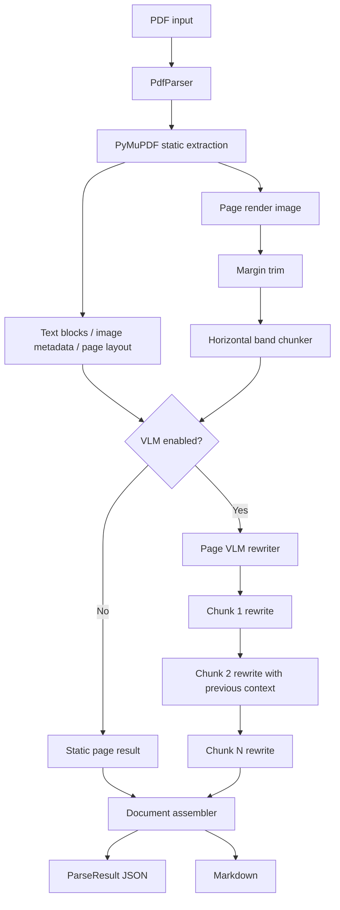

# PDF VLM Parser Design

Date: 2026-06-13

## Goal

Build a PDF-only parser library that always works with PyMuPDF static extraction and can optionally use an OpenAI-compatible VLM API to rewrite the extracted content into higher-quality Markdown.

The library must produce both structured JSON and Markdown. Static extraction remains the source of record for raw text, layout, image metadata, and fallback behavior. VLM output is a rewriting layer that improves reading order, layout interpretation, table formatting, captions, and page-level Markdown.

## Non-Goals

- Non-PDF inputs such as DOCX, PPTX, HTML, or images.
- A dedicated OCR engine.
- A table-specific reconstruction engine.
- Document-level VLM cleanup.
- UI, layout editor, or review workflow.
- Cloud storage integration.

## Key Decisions

- Output format: JSON and Markdown.
- Static parser: PyMuPDF.
- VLM API style: OpenAI-compatible chat completions with image input.
- VLM unit of work: page render image chunks.
- Page processing: pages may run in parallel.
- Chunk processing: chunks inside the same page run sequentially.
- VLM rate control: one global concurrency limiter.
- VLM fallback: if VLM is disabled or fails, static extraction still produces output.
- Initial document scope: PDF only.

## Architecture



## Public API

The main library entrypoint is `PdfParser`.

```python
from vlm_parser import PdfParser, ParseOptions, VlmOptions

parser = PdfParser(
    options=ParseOptions(
        render_dpi=180,
        trim=True,
        auto_slice=True,
    ),
    vlm=VlmOptions(
        enabled=True,
        base_url="https://api.example.com/v1",
        api_key="...",
        model="gpt-4.1-mini",
        max_concurrency=4,
    ),
)

result = parser.parse("sample.pdf")

result.to_json()
result.to_markdown()
result.save_json("out/result.json")
result.save_markdown("out/result.md")
```

Static-only parsing uses the same API with default options.

```python
from vlm_parser import PdfParser

parser = PdfParser()
result = parser.parse("sample.pdf")
```

## Module Layout

```text
vlm_parser/
  __init__.py
  parser.py
  models.py
  options.py

  pdf/
    __init__.py
    document.py
    static_extractor.py
    renderer.py
    image_preprocess.py
    chunker.py

  vlm/
    __init__.py
    client.py
    prompts.py
    rewriter.py
    concurrency.py

  output/
    __init__.py
    assembler.py
    markdown.py
    json_schema.py

  errors.py
```

### Module Responsibilities

- `parser.py`: public orchestration entrypoint. Opens the PDF, applies options, runs page processing, and assembles final output.
- `models.py`: typed data models for parse results, pages, blocks, images, renders, chunks, VLM results, warnings, and errors.
- `options.py`: configuration models for parsing, rendering, trimming, chunking, VLM, retries, and concurrency.
- `pdf/document.py`: PDF document lifecycle wrapper around PyMuPDF.
- `pdf/static_extractor.py`: extracts text blocks, lines, spans, page metadata, image metadata, and raw page text.
- `pdf/renderer.py`: renders each page to an image at the configured DPI.
- `pdf/image_preprocess.py`: trims uniform or near-uniform margins while preserving fallback to the original render.
- `pdf/chunker.py`: splits a trimmed page image into vertical chunks using horizontal blank or single-color bands.
- `vlm/client.py`: OpenAI-compatible VLM client.
- `vlm/prompts.py`: prompt builders for chunk rewriting.
- `vlm/rewriter.py`: sequential chunk rewriting for one page.
- `vlm/concurrency.py`: global VLM request semaphore.
- `output/assembler.py`: combines page results into final document JSON and Markdown.
- `output/markdown.py`: static and VLM result to Markdown conversion.
- `output/json_schema.py`: JSON schema export and validation helpers.
- `errors.py`: library-specific exceptions.

## Processing Flow

1. `PdfParser.parse(path)` opens the PDF.
2. The parser submits pages to a page worker pool.
3. Each page worker runs PyMuPDF static extraction.
4. Each page worker renders the page image.
5. If trim is enabled, the render image is trimmed conservatively.
6. If auto-slice is enabled, the trimmed image is split into vertical chunks.
7. If VLM is disabled, static Markdown is generated for the page.
8. If VLM is enabled, the page's chunks are rewritten sequentially from top to bottom.
9. Every VLM request passes through the global concurrency limiter.
10. Page results are sorted by page number and assembled into the final document result.

## Rendering And Trim Design

The renderer produces one page image per PDF page. The trim step examines the rendered bitmap and removes only outer margins that are white or near-uniform single-color areas.

Trim behavior:

- Detect top, bottom, left, and right uniform margin candidates.
- Treat white and near-uniform background colors as trim candidates.
- Preserve the original render if corner content is detected.
- Preserve the original render if the detected trim area is suspiciously large.
- Store `original_size`, `trimmed_size`, `bbox_in_original`, `applied`, and `reason`.

The trim step must be conservative. A false negative is acceptable because it only sends a larger image to the VLM. A false positive is more serious because it may remove document content.

## Chunking Design

Chunking operates on the trimmed page image.

Inputs:

- Trimmed page image.
- Original render size.
- Trim bounding box.
- `min_chunk_height_px`.
- `max_chunk_height_px`.
- `blank_band_min_height_px`.
- `background_tolerance`.
- `edge_content_guard_px`.

Algorithm:

1. Calculate whether each image row is mostly blank, white, or near-uniform.
2. Merge consecutive candidate rows into horizontal blank bands.
3. Drop candidate bands shorter than `blank_band_min_height_px`.
4. Walk the page from top to bottom.
5. Before a chunk exceeds `max_chunk_height_px`, choose the nearest valid blank band as the split line.
6. Avoid splits that produce chunks shorter than `min_chunk_height_px`.
7. If no safe blank band exists, keep the larger region as one chunk instead of forcing a risky split.
8. Record each chunk's bounding boxes in both original and trimmed image coordinates.

Chunking policy:

- Splits are vertical only.
- Split candidates come from horizontal blank or single-color bands.
- The chunker should prefer fewer, safer chunks over aggressively small chunks.
- Page-level context is preserved by processing chunks sequentially.

## VLM Rewriting

The VLM rewriter runs only when enabled.

For each page:

1. Receive static page extraction, page render metadata, and image chunks.
2. Process chunks in reading order from top to bottom.
3. For each chunk, build a VLM request containing:
   - Current chunk image.
   - Page and chunk indices.
   - Page-level static text.
   - Chunk bounding box metadata.
   - Previous chunk Markdown or a compact accumulated context.
4. Parse the model response into chunk Markdown plus warnings.
5. Assemble chunk Markdown into page Markdown.

Prompt requirements:

- Rewrite the visible content into Markdown.
- Use PyMuPDF text as a reference.
- Preserve tables as Markdown tables when possible.
- Preserve captions, footnotes, headings, and list structure when visible.
- Do not invent content that is not present in the page image or static extraction.
- If the image and static text conflict, prefer a warning over hallucination.

## Concurrency Model

Page processing can run in parallel, but every VLM request must pass through one global limiter.

```text
Document parse
  Page 1 worker -> chunk 1 -> chunk 2 -> chunk 3
  Page 2 worker -> chunk 1 -> chunk 2
  Page 3 worker -> chunk 1 -> chunk 2 -> chunk 3

All VLM calls use GlobalVlmSemaphore(max_concurrency=N)
```

Configuration:

- `max_page_workers`: maximum pages processed in parallel.
- `vlm.max_concurrency`: maximum VLM requests in flight across the whole parse.
- `vlm.timeout_seconds`: request timeout.
- `vlm.max_retries`: retry count for retryable failures.

This keeps page-level throughput high while protecting external API rate limits.

## JSON Output Schema

The schema is versioned with `schema_version`. The initial version is `0.1`.

### Required Top-Level Shape

```text
ParseResult
  schema_version: string
  source: SourceInfo
  options: EffectiveOptions
  document: DocumentResult
  pages: PageResult[]
  warnings: ParseWarning[]
  errors: ParseError[]

SourceInfo
  path: string
  filename: string
  file_size_bytes: integer
  page_count: integer
  parser: ParserInfo

ParserInfo
  name: string
  version: string

EffectiveOptions
  static_engine: "pymupdf"
  render_dpi: integer
  trim_enabled: boolean
  auto_slice_enabled: boolean
  vlm_enabled: boolean
  vlm_model: string | null

DocumentResult
  markdown: string
  metadata: DocumentMetadata

PageResult
  page_number: integer
  width_pt: number
  height_pt: number
  rotation: integer
  static: StaticPageResult
  render: RenderResult | null
  vlm: VlmPageResult | null
  markdown: string
  warnings: ParseWarning[]

StaticPageResult
  text: string
  blocks: StaticBlock[]
  images: StaticImage[]

RenderResult
  original: RenderImage
  trimmed: TrimmedRenderImage
  chunks: RenderChunk[]

VlmPageResult
  enabled: boolean
  status: "success" | "partial" | "failed" | "skipped"
  model: string | null
  chunks: VlmChunkResult[]
  markdown: string
```

All bounding boxes use `[x0, y0, x1, y1]`. PDF-space boxes use points. Render-space boxes use pixels. Fields that cannot be produced because a stage was skipped or failed must be represented as `null` at the stage boundary, while recoverable details are recorded in `warnings` or `errors`.

### Example

```json
{
  "schema_version": "0.1",
  "source": {
    "path": "sample.pdf",
    "filename": "sample.pdf",
    "file_size_bytes": 123456,
    "page_count": 2,
    "parser": {
      "name": "vlm-parser",
      "version": "0.1.0"
    }
  },
  "options": {
    "static_engine": "pymupdf",
    "render_dpi": 180,
    "trim_enabled": true,
    "auto_slice_enabled": true,
    "vlm_enabled": true,
    "vlm_model": "gpt-4.1-mini"
  },
  "document": {
    "markdown": "# Title\n\n...",
    "metadata": {
      "title": null,
      "author": null,
      "subject": null,
      "keywords": null,
      "created_at": null,
      "modified_at": null
    }
  },
  "pages": [
    {
      "page_number": 1,
      "width_pt": 595.28,
      "height_pt": 841.89,
      "rotation": 0,
      "static": {
        "text": "raw extracted page text",
        "blocks": [
          {
            "id": "p1-b1",
            "type": "text",
            "bbox": [72.1, 80.2, 520.3, 120.4],
            "text": "Section title",
            "lines": [
              {
                "bbox": [72.1, 80.2, 520.3, 95.4],
                "spans": [
                  {
                    "text": "Section title",
                    "bbox": [72.1, 80.2, 180.0, 95.4],
                    "font": "Helvetica-Bold",
                    "size": 14.0,
                    "flags": 16,
                    "color": "#000000"
                  }
                ]
              }
            ]
          }
        ],
        "images": [
          {
            "id": "p1-img1",
            "xref": 12,
            "bbox": [100.0, 250.0, 300.0, 420.0],
            "width_px": 640,
            "height_px": 480,
            "colorspace": "DeviceRGB",
            "ext": "png",
            "path": "assets/page-001-image-001.png"
          }
        ]
      },
      "render": {
        "original": {
          "path": "assets/page-001.png",
          "width_px": 1488,
          "height_px": 2105,
          "dpi": 180
        },
        "trimmed": {
          "path": "assets/page-001-trimmed.png",
          "width_px": 1320,
          "height_px": 1840,
          "bbox_in_original": [84, 120, 1404, 1960],
          "applied": true,
          "reason": "uniform_margin_detected"
        },
        "chunks": [
          {
            "id": "p1-c1",
            "index": 0,
            "path": "assets/page-001-chunk-001.png",
            "bbox_in_original": [84, 120, 1404, 780],
            "bbox_in_trimmed": [0, 0, 1320, 660],
            "split_reason": "horizontal_blank_band",
            "height_px": 660
          }
        ]
      },
      "vlm": {
        "enabled": true,
        "status": "success",
        "model": "gpt-4.1-mini",
        "chunks": [
          {
            "chunk_id": "p1-c1",
            "status": "success",
            "markdown": "## Section title\n\n...",
            "usage": {
              "prompt_tokens": 1000,
              "completion_tokens": 300,
              "total_tokens": 1300
            },
            "warnings": []
          }
        ],
        "markdown": "## Section title\n\n..."
      },
      "markdown": "## Section title\n\n...",
      "warnings": []
    }
  ],
  "warnings": [],
  "errors": []
}
```

### Field Semantics

- `source`: information about the source PDF and parser version.
- `options`: effective parse options used for this result.
- `document.markdown`: final document-level Markdown.
- `document.metadata`: metadata extracted from the PDF.
- `pages[].static`: raw PyMuPDF extraction results.
- `pages[].render`: original, trimmed, and chunk render metadata.
- `pages[].vlm`: VLM rewriting result for the page.
- `pages[].markdown`: final page Markdown, either VLM-rewritten or static fallback.
- `warnings`: recoverable issues.
- `errors`: unrecoverable or partially recoverable failures.

## Error Handling

- PDF open failure: fail the parse.
- Page static extraction failure: record page error and continue when possible.
- Page render failure: record page error; static parsing may still continue.
- Trim failure: use original render image.
- Chunking failure: use one full-page chunk.
- VLM retryable failure: retry up to `vlm.max_retries`.
- VLM permanent failure: record warning/error and use static Markdown fallback for that chunk or page.
- JSON validation failure: fail before writing output.

## Testing Plan

Initial test coverage should focus on deterministic units.

- `pdf.image_preprocess`
  - trims white margins.
  - trims single-color margins.
  - skips trim when corner content exists.
  - falls back when trim would remove too much content.
- `pdf.chunker`
  - splits on horizontal blank bands.
  - respects minimum and maximum chunk heights.
  - avoids risky forced splits when no valid band exists.
  - records bounding boxes in original and trimmed coordinates.
- `pdf.static_extractor`
  - extracts page count, raw text, text blocks, spans, and image metadata from sample PDFs.
- `output.assembler`
  - preserves page order.
  - emits both JSON and Markdown.
  - preserves static data even when VLM output exists.
- `vlm.rewriter`
  - calls chunks sequentially within a page.
  - passes previous chunk context to later chunks.
  - uses a mocked OpenAI-compatible client.
  - respects the global concurrency limiter.
  - falls back to static Markdown on VLM failure.

## Acceptance Criteria

- A caller can parse a PDF without VLM and receive valid JSON plus Markdown.
- A caller can enable an OpenAI-compatible VLM client and receive rewritten page Markdown.
- Page workers can run in parallel.
- Chunks inside a page are rewritten sequentially.
- All VLM calls honor one global concurrency limit.
- Render trim records enough metadata to map cropped images back to the original page render.
- Chunk metadata records enough coordinates to trace each image back to the original page.
- VLM failures do not prevent static output unless the source PDF itself cannot be opened.
